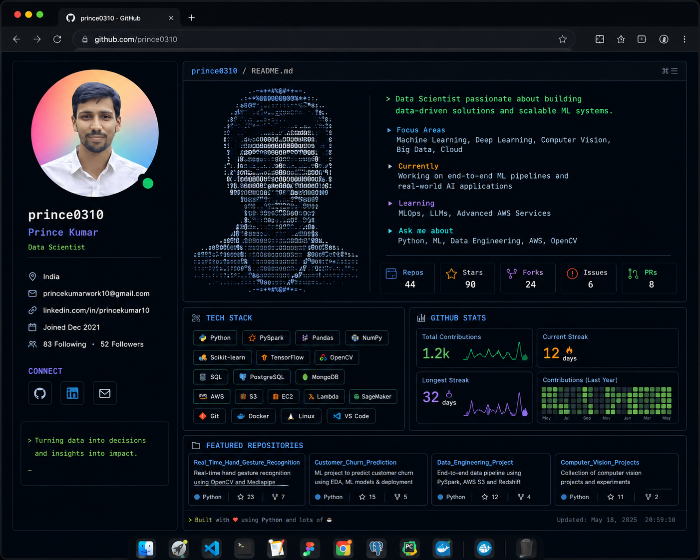

<p align="center">
  
</p>

<h1 align="center">
Hi 👋 I'm Prince Kumar
</h1>

<h3 align="center">
Data Scientist • AI Engineer • Computer Vision • Medical Imaging • Researcher
</h3>


<p align="center">

</p>

<p align="center">

<a href="https://github.com/prince0310">

</a>


<a href="https://github.com/prince0310?tab=repositories">

</a>

</p>

---

# 💻 About Me

```python
class PrinceKumar():

    def __init__(self):

        self.role = "Data Scientist"

        self.interests = [
            "Computer Vision",
            "Medical Imaging",
            "Deep Learning",
            "Large Language Models",
            "Signal Processing",
            "Image Processing",
            "Generative AI"
        ]

        self.currently_learning = [
            "MLOps",
            "AWS",
            "LLMs",
            "Agentic AI"
        ]

        self.goal = "Build AI that solves real-world problems."

me = PrinceKumar()
```

---

## 🚀 Currently Working On

- 🧠 Medical Image Segmentation
- 🎯 Object Detection
- 📈 Feature Engineering
- 🤖 Deep Learning
- 📹 Real-Time Video Analytics
- 🔬 AI Research

---

## 🛠 Tech Stack

### Languages

<p>

</p>

### AI / ML

<p>

</p>

### Tools

<p>

</p>

---

# 📊 GitHub Analytics

<p align="center">


</p>

<p align="center">


</p>

---

# 📈 Contribution Graph

<p align="center">


</p>

---

# 🏆 Achievements

🏅 Two Indian Patents

📚 Research Publications

🤖 AI & Computer Vision Projects

📊 Data Science Enthusiast

📖 Lifelong Learner

---

# 🌐 Connect With Me

<p align="center">

<a href="https://www.linkedin.com/in/prince-kumar-239304209/">

</a>

<a href="mailto:pk8840230@gmail.com">

</a>

<a href="https://leetcode.com/code_with_prince/">

</a>

<a href="https://www.hackerrank.com/pk8840230">

</a>

<a href="https://auth.geeksforgeeks.org/user/princesde/">

</a>

</p>

---

<p align="center">

### ⭐ *"Turning ideas into intelligent systems through Data & AI."*

</p>
