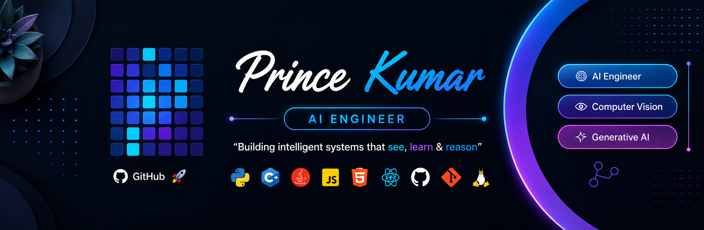

  

 

<h3>
  AI Engineer | Building machines that see, learn & understand
</h3>

 

- 🔭 I'm currently working on **Computer Vision & Generative AI**

- 🌱 I'm currently learning **MLOps, AWS & Agentic AI**

- 👁️ I love exploring **Computer Vision, LLMs & Multimodal AI**

- 💡 Ask me about **Python, Deep Learning, Computer Vision & AI**

- 🧪 I enjoy turning **research ideas into working AI systems**

- 🤝 Always open to **interesting projects & collaborations**

- 📍 From India

 

## 🔗 Connect With Me

 

## 🛠️ Skills

 Languages & Tools

 

 AI / Machine Learning

 

 Generative AI

 

 Frameworks & Libraries

 

 Deployment & MLOps

 

